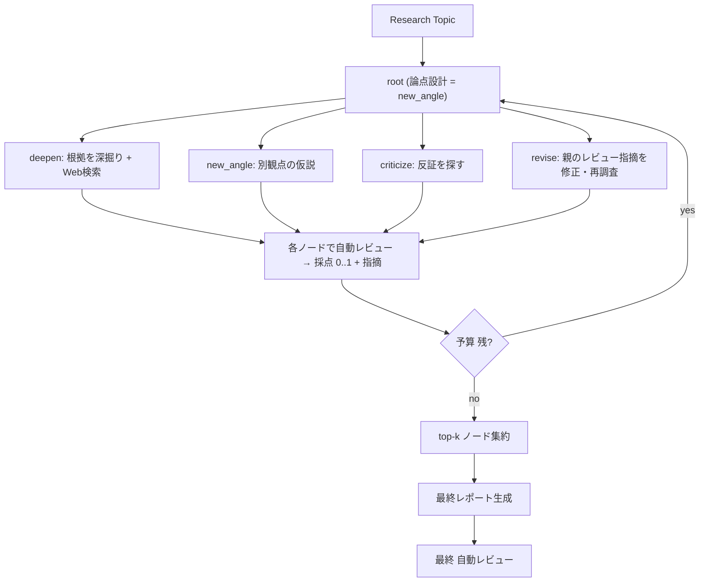

# DeepResearch 実験化計画

## やりたいこと（再整理）

テーマを受け取り、AB-MCTS で「仮説立案 → 情報収集 → 検証」を**数回〜10回ほど自律的に試行錯誤**します。各ステップで「この枝は有望だから深掘り」「この仮説は弱いから棄却」「別観点から探す」という**小さな判断を多数**行い、最後に有望な枝を束ねて最終レポートを作り、自動レビューにかけます。

LLM はローカル1個のみのため、**システムプロンプトの出し分け**で擬似的に役割分担（市場 / 技術 / 戦略など）し、「探索しているのに良くならない」問題も採点ペルソナの分離とレビュー指摘の減点で抑えます。

## 「5段階パイプライン」と「アクション探索」の整合（重要決定）

5段階（論点設計 → 情報収集 → 検証 → レポート → 自動レビュー）を1ノードに直列で詰めるのではなく、**役割を分けます**。さらに、ご要望の「自動レビュー後の修正・再調査も MCTS の判断で回す」を、**自動レビューをノード生成のたびに実施し、その指摘を `revise` アクションで木の中で解消する**形に組み込みます。これにより「修正・再調査するか／別観点へ広げるか／捨てるか」も AB-MCTS が自律判断します。

- **探索フェーズ（木）**: 1ノード = 1回の調査ステップ。ノードは `new_angle / deepen / criticize / revise` のいずれかのアクションで生成され、内部で「情報収集（Web検索）→ 検証 → そのステップの結論 → 自動レビュー（採点と指摘）」を行う。
  - `new_angle`: 論点設計・別観点の仮説
  - `deepen`: 根拠の深掘り・裏取り
  - `criticize`: 反証・弱点探し
  - `revise`: **親ノードの自動レビュー指摘（根拠不足・古い情報・矛盾・弱い出典・飛躍）を解消するための修正・再調査**。指摘に応じて再検索クエリを作り、主張を直す。
- **合成フェーズ（探索後）**: top-k ノード（有望な枝）を集約し、最終レポートを1回生成 → 最終の自動レビューを1回実行。

つまり自動レビューは「探索中（各ノードの採点・指摘）」と「探索後（最終レポート）」の2層で行い、修正ループは探索木に内包されます。



各生成関数は TreeQuest の前提どおり必ず `(state, score)` を返し、`score` は 0.0〜1.0 に正規化します。`revise` は親の指摘を減らせたぶんスコアが上がるため、MCTS は「直すと伸びる枝」を自然に深掘りします。

複雑さの注記: `revise` の追加は generate_fn が1つ増えるだけで、探索ループ・採点・合成の構造は変わりません。もし最初から入れたくない場合は、`actions` から `revise` を外せば3アクション構成にフォールバックできます（実装は分岐1つで切替可能にします）。

## 既存資産の流用と差し替え

### 流用するもの
- `experiments/arc2/run.py` の探索ループ、チェックポイント保存、ログ出力、Hydra 構成
- `src/ab_mcts_arc2/llama_server.py`（ローカルLLM呼び出し）
- `src/ab_mcts_arc2/web_search.py`（SearXNG 検索）
- `EvalResultWithScore`（`get_score()` がそのまま [0,1] スコアになる）

### 差し替えるもの
- `ARCProblem` 読込・`transform` 評価 → DeepResearch のノード状態・採点
- `call_llm`（API課金モデル）→ ローカルLLM経路

## 変更内容

### 1. config.yaml（ローカルLLM 1個へ）
現在の3 API モデルを、ローカルLLM 1個に変更します。

```yaml
research_topic: "調査したいテーマをここに書く"
max_num_nodes: 10        # AB-MCTS の試行回数（数回〜10回）
checkpoint_path: null

# ローカルLLM（llama_server）デフォルト。環境変数 LLAMA_SERVER_* があればそちらを優先。
llm:
  base_url: "http://127.0.0.1:1067"
  model: "unsloth/Qwen3.6-27B-MTP-GGUF-UD-Q4_K_XL"
  enable_thinking: false
  temperature: 0.3
  max_tokens: 1200

# Web検索（SearXNG）デフォルト。環境変数 SEARXNG_* があればそちらを優先。
search:
  url: "http://127.0.0.1:4866"
  engines: "google,bing,brave,yandex"
  language: "ja"
  max_results: 5

algo:
  class_name: "ABMCTSA"  # "ABMCTSM" も選択可
  params:
    model_selection_strategy: "stack"

hydra:
  run:
    dir: outputs/deepresearch/${algo.class_name}_${now:%Y-%m-%d_%H-%M-%S}
```

`models:`（3つのAPIモデル）は削除し、単一ローカルLLM前提にします。

これらのデフォルトは `run.py` の起動時に `os.environ.setdefault()` で対応する環境変数へ反映します（既に環境変数があればユーザー設定を尊重）。

```python
# run.py main() 冒頭で config → 環境変数（未設定時のみ）
import os
os.environ.setdefault("LLAMA_SERVER_BASE_URL", cfg.llm.base_url)
os.environ.setdefault("LLM_MODEL", cfg.llm.model)
os.environ.setdefault("LLAMA_SERVER_ENABLE_THINKING", str(cfg.llm.enable_thinking).lower())
os.environ.setdefault("LLAMA_SERVER_TEMPERATURE", str(cfg.llm.temperature))
os.environ.setdefault("LLAMA_SERVER_MAX_TOKENS", str(cfg.llm.max_tokens))
os.environ.setdefault("SEARXNG_URL", cfg.search.url)
os.environ.setdefault("SEARXNG_ENGINE", cfg.search.engines)
os.environ.setdefault("SEARXNG_LANGUAGE", cfg.search.language)
```

PowerShell から明示的に上書きしたい場合の例（任意）:

```powershell
$env:LLAMA_SERVER_BASE_URL='http://127.0.0.1:1067'
$env:LLM_MODEL='unsloth/Qwen3.6-27B-MTP-GGUF-UD-Q4_K_XL'
$env:LLAMA_SERVER_ENABLE_THINKING='false'
$env:LLAMA_SERVER_TEMPERATURE='0.3'
$env:LLAMA_SERVER_MAX_TOKENS='1200'
$env:SEARXNG_URL='http://127.0.0.1:4866'
$env:SEARXNG_ENGINE='google,bing,brave,yandex'
$env:SEARXNG_LANGUAGE='ja'
```

### 2. ローカルLLMアダプタ（llm-adapter）
`run.py` の `from ab_mcts_arc2.llm.llm_builder import call_llm` を外し、`llama_server` を使う薄いラッパを追加します。

```python
from ab_mcts_arc2.llama_server import (
    LlamaServerEnvConfig, run_llama_server_completion_sync, messages_to_prompt,
)

def call_local_llm(system_prompt: str, user_prompt: str, temperature: float) -> str:
    cfg = LlamaServerEnvConfig.from_env().with_overrides(temperature=temperature)
    prompt = messages_to_prompt(
        [{"role": "system", "content": system_prompt},
         {"role": "user", "content": user_prompt}]
    )
    return run_llama_server_completion_sync(cfg, prompt)
```

- `llama_server` は文字列を返すのみ（コストなし）。`run.py` のコスト集計は 0 固定 or 撤去し、時間計測は残します。
- 接続先・モデルは `LLAMA_SERVER_*` / `LLM_MODEL` 環境変数で制御（既存仕様どおり）。

### 3. Web検索（search）
`SearXNGSearchClient` を使い、未設定/失敗時はダミーへフォールバックします。

```python
from ab_mcts_arc2.web_search import SearXNGSearchClient

def web_search(query: str, max_results: int) -> list[dict]:
    client = SearXNGSearchClient()
    if not client.is_available():       # SEARXNG_URL 未設定
        return dummy_web_search(query, max_results)
    resp = client.search(query, limit=max_results)
    if not resp.success or not resp.results:
        return dummy_web_search(query, max_results)
    return [{"title": r.title, "url": r.url, "snippet": r.description} for r in resp.results]
```

`dummy_web_search()` は固定スニペットを返す関数として残し、検索サーバが落ちている/応答しない場合のフォールバック兼テスト用にします。デフォルトでは `SEARXNG_URL=http://127.0.0.1:4866`、`SEARXNG_ENGINE=google,bing,brave,yandex`（`web_search.py` 既存の「順番に試して最初に成功したものを使う」方針と一致）、`SEARXNG_LANGUAGE=ja` で実検索を行います。

### 4. システムプロンプトによる役割分担（personas）
単一モデルを複数役割に見せるためのシステムプロンプト群を `prompt.py` に定義します。

- リサーチャーペルソナ（観点の多様化）: 例 `市場`, `技術`, `戦略`。`new_angle` 時に観点をローテーションして仮説の多様性を確保。
- アクション別の指示:
  - `new_angle`: 新しい論点・仮説を立てる（未探索の観点を要求）
  - `deepen`: 直近の仮説について Web検索結果を根拠に深掘り・裏取り
  - `criticize`: 反証・弱点・古い情報・矛盾を探す
  - `revise`: 親ノードのレビュー指摘リストを入力に、不足した根拠の再検索・主張の修正を行う
- レビュアーペルソナ（採点者）: 生成者とは別のシステムプロンプト。根拠充足・新しさ・矛盾の少なさ・出典の強さ・結論の妥当性を評価し、採点と指摘リストを返す。

### 5. ノード状態とアクション（actions）
`utils.py` の `NodeState` を DeepResearch 用に変更します。

```python
@dataclass
class NodeState:
    topic: str
    action: str            # new_angle | deepen | criticize | revise
    perspective: str       # 市場 | 技術 | 戦略 ...
    text: str              # このステップの仮説・調査結論
    sources: list[dict]    # 収集した出典
    findings: list[str]    # 自動レビューの指摘（根拠不足・古い情報・矛盾・弱い出典・飛躍）
    eval_results: list     # EvalResultWithScore など
    score: float
```

各 `generate_fn(parent_state)` は「クエリ生成 → `web_search` → ローカルLLMで仮説/検証/反証/修正 → レビュアー採点（指摘 `findings` 付き）」を行い `(NodeState, score)` を返します。`parent_state is None` のときは root（論点設計）として初期仮説を作ります。`revise` は `parent_state.findings` を読み、指摘解消に向けた再検索・修正を行います（親が指摘ゼロなら `deepen` 相当にフォールバック）。

### 6. スコア設計（scoring、「良くならない」対策）
- 採点は**レビュアーペルソナ**（生成と別システムプロンプト）で実施し、自己過大評価を抑える。
- レビュー出力から指摘（根拠不足・古い情報・矛盾・弱い出典・飛躍）を抽出し、**指摘数に応じて減点**。
- 出典が0件・検索失敗のノードは上限スコアを抑える。
- 最終スコアは `clamp01(base_review_score - penalty)` で [0,1] に正規化。

### 7. ランナーとアルゴリズム切替（runner）
`algo.class_name` で2系統を切り替えます。

```python
actions = ["new_angle", "deepen", "criticize", "revise"]  # revise を外せば3アクション構成
generate_fns = {a: partial(generate_fn, action=a, ...) for a in actions}

if algo_name == "ABMCTSM":
    algo = tq.ABMCTSM(**params)        # ask_batch / tell 経路
    search_tree = algo.init_tree()
    for step in range(num_steps):
        search_tree, trials = algo.ask_batch(search_tree, batch_size, actions)
        for trial in trials:
            # 実 Trial 属性: trial_id, node_to_expand, action, score,
            #               parent_state, created_at, completed_at, trial_status
            result = generate_fns[trial.action](trial.parent_state)
            search_tree = algo.tell(search_tree, trial.trial_id, result)
else:  # ABMCTSA など既存 step 経路
    algo = getattr(tq, algo_name)(**params)
    search_tree = algo.init_tree()
    for _ in range(max_num_nodes):
        search_tree = algo.step(search_tree, generate_fns)
```

探索後、`tq.top_k(search_tree, algo, k=K)` で有望ノードを集約し、最終レポートを1回生成 → 自動レビューを1回実行して保存します。

### 8. ロガー（logging）
Hydra 出力先（`save_dir`）配下に専用の `logs/` と `tree/` を作り、4種類のログを残します。既存の `llm_logs/` `costs/` `checkpoints/` はそのまま併存させます。小さな `ResearchLogger` クラスを `experiments/arc2/` 内（例: `logging_utils.py`）に置き、`run.py` から呼びます。

出力構成:

```
<save_dir>/
  logs/
    events.jsonl       # 時系列ログ（機械可読・1イベント1行）
    research.log       # 人間向けログ（読みやすいテキスト）
    progress.md        # 人間向けサマリ（ステップ進行・スコア推移）
  llm_io/
    llm_calls.jsonl    # LLM投入用ログ（全プロンプト/応答を構造化）
    call_XXXX.json     # 1呼び出し1ファイル（リプレイ・再投入用）
  tree/
    nodes.jsonl        # ノード情報
    edges.jsonl        # エッジ情報（親→子 + アクション）
    tree.html          # tq.render による可視化（既存機能を流用）
```

- **時系列ログ `events.jsonl`**: 1行1イベントの JSON。
  `{"ts": ISO8601, "event": "node_generated|search|review|final_report", "node_id": str, "parent_id": str|null, "action": str, "perspective": str, "score": float, "query": str|null, "num_sources": int, "findings": [..], "elapsed_ms": int}`。あとから探索過程を機械的に追跡・集計できる正本。
- **人間向けログ `research.log`**: Python `logging` の `FileHandler` を `save_dir/logs/research.log` に追加（既存 `logger` を流用）。`step=03 action=deepen perspective=技術 score=0.62 sources=4 findings=2` のような1行サマリと、要点本文を読みやすく出力。
- **人間向けサマリ `progress.md`**: ステップごとのベストスコア推移、採用された論点、棄却された仮説を Markdown で追記。最後に最終レポートと自動レビュー結果へのリンク/抜粋を載せる。
- **LLM投入用ログ `llm_io/`**: `call_local_llm` をラップし、`{ "ts", "node_id", "action", "perspective", "role": "researcher|reviewer", "system", "user", "response" }` を `llm_calls.jsonl` に追記しつつ、1呼び出しを `call_XXXX.json` にも保存。後でプロンプトの再投入・回帰比較・データセット化に使える形（既存 `llm_logs/` を置き換え/拡張）。
- **ノード/エッジ情報 `tree/`**:
  - `nodes.jsonl`: `{"node_id", "depth", "action", "perspective", "score", "text", "sources", "findings"}`
  - `edges.jsonl`: `{"parent_id", "child_id", "action", "score_delta"}`（`revise` で指摘が減ってスコアが伸びた量も記録）
  - `tree.html`: 既存の `tq.render(..., state_formatter=...)` を流用し、ノードに score/action/perspective を表示。

実装方針: `ResearchLogger` は `events.jsonl`・`llm_calls.jsonl`・`nodes/edges.jsonl` への追記メソッドと、`research.log`/`progress.md` への整形出力メソッドを持つ薄いクラスにします。`generate_fn` 内（生成・検索・採点の各ポイント）と探索ループ（ステップ終了時）、合成フェーズ（最終レポート）から呼び出します。スレッド/並列（`ABMCTSM` の `max_process_workers`）に備え、追記は1行ずつフラッシュし、必要なら簡易ロックで保護します。

## テスト方針
- Red: `dummy_web_search()`、`web_search()` のフォールバック分岐、レビュー採点（指摘→減点）、`clamp01`、ノード状態更新、`ResearchLogger`（events/llm_io/nodes/edges への追記とJSON妥当性）の最小テストを先に追加。
- Green: ダミー検索だけでローカルLLMをモックし、`(NodeState, score)` が返り score が [0,1] に収まること、各ログファイルが1行ずつ正しいJSONで追記されることを確認。
- Refactor: ARC由来の命名・`transform` 前提を DeepResearch 用語へ整理。
- 実行確認: `uv run --link-mode=copy pytest experiments/arc2/`（OneDrive のため `--link-mode=copy` 必須）。

## 注意点・リスク
- `treequest[abmcts-m]` は `pyproject.toml` に既存のため `ABMCTSM` も原則追加インストール不要。Trial 属性は確定済み（`trial_id` / `node_to_expand` / `action` / `score` / `parent_state` / `created_at` / `completed_at` / `trial_status`）で、生成には `trial.action` と `trial.parent_state` を使う。
- `llama_server` は OpenAI **Responses API**（`client.responses.create`）を使用。llama-server 側は対応済みのため、そのまま利用する。
- `web_search` の接続先・エンジン・言語は config 既定値（`http://127.0.0.1:4866` / `google,bing,brave,yandex` / `ja`）を `os.environ.setdefault` で適用。サーバ未起動や応答不可時はダミーへフォールバック。
- `.env` 系（`LLAMA_SERVER_*` 等の秘匿値）はエージェントが触らず、ユーザーが設定する前提。
- `experiments/arc2/` を直接置き換えるため、このディレクトリでの ARC-2 実験は動かなくなる。
- コストは API 非依存になるため、`run.py` のコスト集計は 0 固定 or 撤去（時間計測は維持）。
