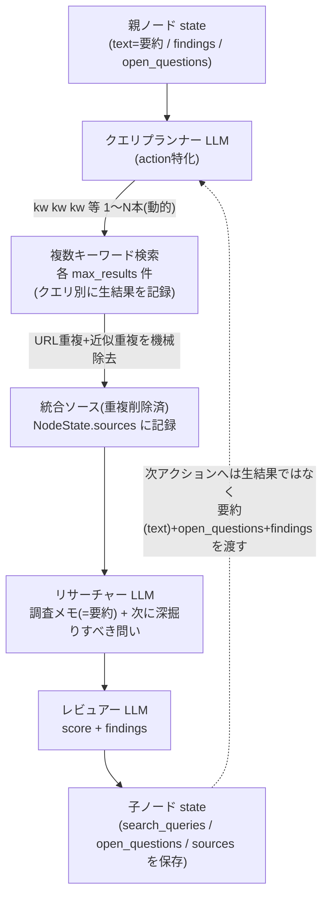

# DeepResearch 探索ループ改善

## 背景と問題

現状 `generate_fn` は「検索 → 調査 → レビュー」の順で、検索クエリは [experiments/arc2/utils.py](experiments/arc2/utils.py) の `build_search_query` が `親.text[:80]` や `findings[:2]` を**自然文のまま連結**して作っている。このため:

- `次に深掘りすべき問い` が次アクションの検索に使われない（`NodeState` に保存すらされない）。
- 検索クエリが長い自然文になり、`criticize/revise/deepen/new_angle` の役割差が検索結果に反映されない。
- 1ノード1検索のみ。

## 目指す姿

データの流れの要点（重複伝播の防止）:
- 次ノードへ渡るのは生の検索結果ではなく、親の調査メモ(`text`=要約)＋`open_questions`＋`findings`。似た結果が3本まとめて子へ伝播することはない。
- 1ノード内では、複数クエリの生結果を**クエリ別に記録**しつつ、**URL重複＋近似重複(スニペット類似)を機械的に除去**したソースをリサーチャーへ渡す（LLM呼び出しは3回のまま増やさない）。

クエリ本数は**動的**: プランナーLLMが「対象とすべき問いがいくつあるか」に応じて 1〜`max_queries` 本を返す。`max_queries` は上限であり、常に上限本数を出すわけではない（問いが1つなら1本）。

アクション別のプランナー方針（役割分担の核）:
- new_angle: 親の主張を引きずらず、`perspective` 起点で未探索角度のキーワード。
- deepen: 親の `open_questions`(次に深掘りすべき問い)を具体化したキーワード。
- criticize: 親の主張への反証・弱点を突くキーワード。
- revise: 親の `findings`(レビュー指摘)を埋めるキーワード。
- root(親なし): **クエリプランナーを通す**。自然文にせず「概要を素早く掴むためのキーワード群」を `topic + perspective` から生成（例: 主要トピックの全体像/最新動向/主要プレイヤーを別々の短いクエリで広く当てる）。

## 変更内容

### 1. NodeState 拡張 — [experiments/arc2/utils.py](experiments/arc2/utils.py)
`NodeState` に2フィールド追加（`asdict` 経由で nodes.jsonl に自動反映される）:
- `search_queries: list[str]` — このノードで実際に使った検索クエリ群
- `open_questions: list[str]` — このノードが出した「次に深掘りすべき問い」

### 2. クエリプランナー — [experiments/arc2/prompt.py](experiments/arc2/prompt.py)
- `query_planner_system_prompt()` と `build_query_planner_prompt(*, topic, action, perspective, parent_state, max_queries, max_words)` を追加。
- 出力は厳格JSON `{"queries": ["語 語 語", ...]}`。各クエリは最大 `max_words`(既定6)語、本数は 1〜`max_queries` の範囲でLLMが動的に決める。アクション別の指示文を埋め込む。
- root(親なし)もこのプランナーを使い、概要把握向けの広めキーワード群を生成させる（自然文を禁止する指示を明記）。

### 3. パーサ/正規化ヘルパー — [experiments/arc2/utils.py](experiments/arc2/utils.py)
- `parse_query_plan(text, *, max_queries, max_words) -> list[str]`: JSON抽出(既存 `parse_json_object` 流用)→各クエリをトリム・語数clamp・重複除去。
- `extract_open_questions(text) -> list[str]`: 調査メモ末尾の `## 次に深掘りすべき問い` セクションを機械パース（番号/箇条書き行を抽出）。researcher出力フォーマットは現状維持でよい。
- `build_fallback_queries(topic, action, parent_state, perspective)`: プランナーがJSON解析失敗した場合**のみ**の保険（topic+perspective等の短いキーワード）。通常経路では使わない。
- `merge_and_dedupe_sources(per_query_results) -> list[dict]`: 複数クエリ結果を結合し、(1)URL重複除去、(2)近似重複除去を機械的に実施。近似重複は `difflib.SequenceMatcher`(標準ライブラリ)で `title+snippet` 正規化文字列の類似度がしきい値 **0.9** を超える既存項目があれば破棄。残った項目に `position` を振り直す。
- 既存 `build_search_query` は撤去し、上記に置換。

### 4. generate_fn 再構成 — [experiments/arc2/run.py](experiments/arc2/run.py)
新フロー:
1. `perspective` 決定。
2. プランナーLLM呼び出し（`role="planner"`, 低温）→ `parse_query_plan` で 1〜`max_queries` 本のクエリ群。root含め常にプランナーを通す。JSON解析失敗時のみ `build_fallback_queries`。
3. クエリごとに `web_search(q, max_results)` を実行。**クエリ単位で `log_event("search", ...)`** に生結果も含めて記録（`query`, `query_index`, `results`, `num_sources`, `search_success`）。その後 `merge_and_dedupe_sources` でURL重複＋近似重複を除去してマージ（これを `NodeState.sources` に保存）。
4. リサーチャーLLM（重複削除済みソート済みソースと、親の `open_questions` を `# 親ノード` に含めて渡す）→ 調査メモ(=次へ渡る要約)。`extract_open_questions` で `open_questions` を取得。
5. レビュアーLLM → `score`/`findings`（既存ロジック流用）。
6. `NodeState(search_queries=..., open_questions=...)` を構築。`search_success` は「全クエリ中いずれか成功」で集約し `score_review` へ。
- `generate_fns` の `partial` に `max_queries` / `max_query_words` を追加。`call_local_llm` は既にロールを取れるので `role="planner"` を追加するだけ。

### 5. ログ強化
- LLMコール: プランナー呼び出しも `log_llm_call(role="planner")` で `llm_io/` に保存（既存機構で自動）。
- 進捗 [experiments/arc2/run.py](experiments/arc2/run.py) の `log_progress`: ノードの本文に加え `- search_queries:` と `- open_questions:` を列挙（全文。`text[:1000]` は前回修正済みで全文出力）。
- tree可視化 [experiments/arc2/utils.py](experiments/arc2/utils.py) `state_formatter_html`: `search_queries` と `open_questions` を追記（任意）。

### 6. 設定 — [experiments/arc2/configs/config.yaml](experiments/arc2/configs/config.yaml)
`search:` に追加:
- `max_queries: 3`
- `max_query_words: 6`
`apply_env_defaults` 経由ではなく `generate_fn` partial へ直接渡す（検索系は env を介さない値のため）。

### 7. テスト — [experiments/arc2/test_deepresearch.py](experiments/arc2/test_deepresearch.py)
- `parse_query_plan`: 正常JSON / 6語超のclamp / 重複除去 / JSON不正時フォールバック。
- `extract_open_questions`: 見出しあり/なしの抽出。
- `merge_and_dedupe_sources`: URL重複の除去 / 近似重複(類似スニペット)の除去 / `position` 振り直し。
- `NodeState` 生成箇所へ新フィールド追加（後方互換: 既定 `[]`）。
- 既存 `generate_fn` テストのモックにプランナー応答を追加。

## 留意点
- ABMCTSM の (親, アクション) 選択ロジック自体は変更しない。役割差は「アクション特化のクエリ生成＋検索」で表現する。
- 1ノードのLLM呼び出しは3回（プランナー→リサーチャー→レビュアー）に増える。`max_tokens=30000` 据え置き、プランナーは短い出力想定。
- researcher の出力フォーマットは現状維持（JSON化しない）。`次に深掘りすべき問い` 見出しの機械パースで受け渡すため堅牢。