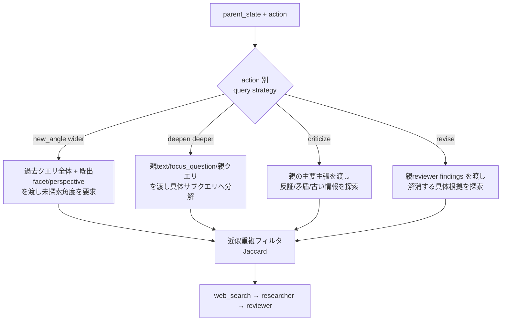

## DeepResearch 探索の多様化（プロンプト / generate_fns 再設計）

### 前提・方針（確定済み）
- 単一ローカルLLM(`llama_server`)を維持。variation 軸は `prompt × action × query-strategy × scorer`。`generate_fns` のキーは現状どおり action のままにし、`ask_batch`/`tell` ループ（[run.py](experiments/arc2/run.py) 699-710）は変更しない。
- 仕様書 `docs/AB-MCTS-M_SPEC.md` 5.3 の警告に従い、scorer は **action ごとに別スケールにせず**、同一の `[0,1]` 基準を保ったまま「観点だけ」をモード別に変える（甘い採点器に偏らせない）。

### 実行ログ診断（`outputs/.../ABMCTSM_2026-06-27_13-58-02`）
- perspective が「市場」に9/10固定 → `choose_perspective`（[utils.py](experiments/arc2/utils.py) 59-63）が `depth % len` 依存で、深さ1ばかりのため常に先頭。
- ノード7と8（同一facetの`criticize`）が `Digital Omnibus GDPR ... June 2026` 等ほぼ同一クエリを生成、両者 `repetition_penalty=0.000` → `query_set_signature`（完全一致集合, 257-258）が近似重複を取りこぼす。
- クエリ生成が実質共通テンプレ（[prompt.py](experiments/arc2/prompt.py) `build_query_planner_prompt` 212-291）で、モード差は `ACTION_QUERY_INSTRUCTIONS` の1行のみ。

### 変更1: モード別クエリ生成戦略（[prompt.py](experiments/arc2/prompt.py)）
- `build_query_planner_prompt` を「共通骨格 + action別 strategy block」に再構成。`ACTION_QUERY_INSTRUCTIONS`（37-42）を、渡すコンテキストと生成方針まで含む `QUERY_STRATEGIES` に拡張。
  - `new_angle`(wider): 過去使用クエリ群と既出 facet/perspective を提示し、「未探索の facet/observation 角度で、過去クエリと語が重複しないクエリ」を要求。
  - `deepen`(deeper): 親ノードの `text` 抜粋 + `focus_question` + 親 `search_queries` を提示し、「focus_question を検証可能な具体サブクエリへ分解、親クエリと別語に」。
  - `criticize`: 親の主要主張を抽出して提示し、「反証・矛盾・古い情報・未検証前提」を狙う。
  - `revise`: 親 `reviewer findings` を提示し、各 finding を解消する具体根拠/事例/企業名を狙う。
- `avoid_queries` を「直近20」から、used_queries 全体の代表的 dedup 集合へ拡張（[run.py](experiments/arc2/run.py) 228）。

### 変更2: perspective 多様化（[utils.py](experiments/arc2/utils.py) / [run.py](experiments/arc2/run.py)）
- `exploration_state` に `perspective_counts` を追加（init は run.py 661-667）。
- `choose_perspective` を `choose_facet`（114-117）と同様の「最小使用回数を選ぶ」方式に変更。`new_angle`/root では least-used perspective、それ以外は親継承を維持。facet と perspective の組で網羅性を担保。

### 変更3: 近似重複クエリの抑制（[utils.py](experiments/arc2/utils.py) / [run.py](experiments/arc2/run.py) / config）
- トークン集合 Jaccard ヘルパ `query_set_jaccard` を追加し、`query_token_signature`（語の bag、小文字化）を保存。
- `repetition_penalty` 判定（run.py `_is_repeated_sources` 144-150 周辺）に「新クエリ集合 vs 既出集合の最大 Jaccard ≥ 閾値」を追加 → ノード7/8 のような近似重複を捕捉。
- 生成時フィルタ: `parse_query_plan`（70-89）で used_queries との Jaccard が高いクエリを除外し、不足時に既存 `build_fallback_queries` で補完。
- config に `exploration.query_similarity_threshold`（既定 0.6）を追加。

### 変更4: モード別 researcher / reviewer 観点（[prompt.py](experiments/arc2/prompt.py)）
- `researcher_system_prompt`（81-103）にモード別の出力強調を追加（deepen=裏取りの深さ、criticize=反証の明示、revise=指摘解消の証跡）。
- `reviewer_system_prompt`（106-128）は採点スケール（0.0–1.0 基準）を不変としつつ、action を受け取り「そのモードで価値ある成果か」の観点だけ補足（例: criticize は本物の矛盾/古さを見つけたか）。スコアの意味は全モード共通に保つ。

### 変更5: スコア較正と深掘り促進（[utils.py](experiments/arc2/utils.py) `score_review` 353-367 / config）
- 検索失敗(dummy)時の二重減点（0-source 0.20 + !success 0.05）を緩和し、全ノードが 0.2 付近に潰れて探索信号が平坦化する問題を是正。
- これにより良質ノードのスコア差が出て AB-MCTS-M が deeper を選びやすくする（深さは間接制御）。`coverage_bonus`/`novelty_penalty_weight` は config で調整可能なまま維持。

### 触るファイル
- [experiments/arc2/prompt.py](experiments/arc2/prompt.py): 変更1, 4
- [experiments/arc2/utils.py](experiments/arc2/utils.py): 変更2, 3, 5
- [experiments/arc2/run.py](experiments/arc2/run.py): 変更1(avoid拡張), 2(state), 3(penalty判定)
- [experiments/arc2/configs/config.yaml](experiments/arc2/configs/config.yaml): `query_similarity_threshold` 等の追加
- 新規ファイルは作らない。`generate_fns`/`ask_batch` の構造は不変。

### 検証
- 同一トピックで再実行し、`progress.md` で (a) perspective が分散するか、(b) 近似重複ノードに `repetition_penalty>0` が付くか、(c) depth>1 ノードが出るか、(d) スコア分布が 0.2 一辺倒でなくなるかを確認。
- `tq.render` の `tree.html` で wider/deeper の混在を目視確認。
