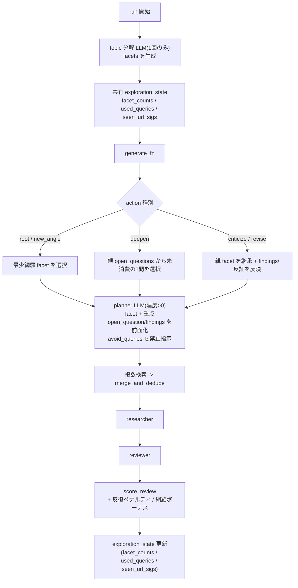

## 背景（確認済みの根本原因）

`outputs/.../logs/events.jsonl` と `progress.md` から確認:

- ABMCTSM がほぼ毎回 `parent_id=null`（root）から生成 → planner が `temperature=0.0`＋topic のみで動き、**同一3クエリ**を反復 → 同一ソース → スコアが 0.54 に固着。スコアが平坦なため ABMCTS に勾配がなく root 再展開が強化される（問題2）。
- 親付きノードは `open_questions` を使って良いクエリを出すが、プロンプト上で `open_questions` が JSON に埋もれ行動変容に至らないケースが多い（問題3）。
- topic の後半「日本企業の対応」を狙うファセット網羅の仕組みが無い（問題4）。

ABMCTS の (親, アクション) 選択ロジックは変更しない（既存方針踏襲）。代わりに planner 入力・探索多様化・スコア勾配で是正する。

## 目指すフロー

## 変更内容

### 1. NodeState 拡張 — [experiments/arc2/utils.py](experiments/arc2/utils.py)
- `facet: str | None = None` を追加（`asdict` 経由で nodes.jsonl/最終レポートに自動反映）。

### 2. planner の脱・決定論化＋入力強化 — [experiments/arc2/prompt.py](experiments/arc2/prompt.py), [experiments/arc2/run.py](experiments/arc2/run.py)
- `run.py` の planner 呼び出しを `temperature=0.0` 固定から config 値 `exploration.planner_temperature`（既定 0.5）に変更。root 再展開が毎回同一になる直接原因を解消。
- `build_query_planner_prompt` に引数追加: `facet: str | None`, `avoid_queries: list[str]`, `focus_question: str | None`。
  - `open_questions` と `findings` を JSON 埋め込みから**独立した見出しセクション**へ昇格し、アクション別に必須利用を明記:
    - `deepen`: `focus_question`（親 open_questions から1問）を具体キーワードに分解。
    - `revise`: 親 `findings` を埋める追加根拠クエリ。
    - `criticize`: 親主張への反証クエリ。
    - `new_angle`/root: 指定 `facet` に沿った未探索キーワード。
  - `# 避けるクエリ` セクションに `avoid_queries` を列挙し「これらと同一/酷似のクエリを出さない」と指示。
- `query_planner_system_prompt`: 「avoid_queries の反復禁止」「英語の技術用語・固有名詞（企業名/PETs/ZKP等）を許可」「日本語縛りを緩和」を追記。問題3の「英語・企業名クエリが反映されない」を直接是正。

### 3. topic ファセット分解＋網羅誘導 — [experiments/arc2/prompt.py](experiments/arc2/prompt.py), [experiments/arc2/utils.py](experiments/arc2/utils.py), [experiments/arc2/run.py](experiments/arc2/run.py)
- `prompt.py`: `topic_decomposition_system_prompt()` と `build_topic_decomposition_prompt(topic, num_facets)` を追加（出力 `{"facets": [...]}`）。
- `utils.py`: `parse_facets(text, num_facets) -> list[str]` と `choose_facet(facets, facet_counts) -> str`（最少カウントを選択）を追加。
- `run.py`: 起動時に分解 LLM を**1回だけ**呼び出して `facets` を確定（失敗時は topic を「と/、」で機械分割するフォールバック）。`research_logger.log_event("facets", ...)` で記録。

### 4. 反復ペナルティ＋網羅ボーナスでスコアに勾配 — [experiments/arc2/utils.py](experiments/arc2/utils.py), [experiments/arc2/run.py](experiments/arc2/run.py)
- `utils.py`:
  - `query_set_signature(queries) -> frozenset[str]`、`source_url_signature(sources) -> frozenset[str]` を追加。
  - `score_review` に `repetition_penalty: float = 0.0`, `coverage_bonus: float = 0.0` を追加し、`score = base - findings罰 - 既存罰 - repetition_penalty + coverage_bonus`（`clamp01`/`round`）。
- `run.py`: 共有 `exploration_state`（`facet_counts: dict`, `used_queries: set`, `seen_query_sigs: set`, `seen_url_sigs: list[frozenset]`）を `partial` 経由で `generate_fn` に渡す（ABMCTSM の generate はメイン処理で逐次実行のため共有可変状態は安全）。
  - クエリ集合が既出、または URL 集合の Jaccard 類似が高い場合 → `repetition_penalty = exploration.novelty_penalty_weight`。
  - 当該 `facet` が未網羅（カウント0）だった場合 → `coverage_bonus = exploration.coverage_bonus`。
  - 生成後に `facet_counts`/`used_queries`/`seen_*` を更新。
- これにより同型 root 再展開ほど低スコアになり、ABMCTS が自然に多様化・深掘りへ向かう（問題2）。

### 5. 設定 — [experiments/arc2/configs/config.yaml](experiments/arc2/configs/config.yaml)
`exploration:` セクションを追加:
- `planner_temperature: 0.5`
- `num_facets: 4`
- `novelty_penalty_weight: 0.15`
- `coverage_bonus: 0.05`
`generate_fn` の `partial` へ直接配線（既存の search 系と同様、env を介さない）。

### 6. ログ強化 — [experiments/arc2/run.py](experiments/arc2/run.py), [experiments/arc2/utils.py](experiments/arc2/utils.py)
- `progress.md`/`node_generated` イベントに `facet`・`repetition_penalty`・`coverage_bonus`・選択した `focus_question` を出力。
- `state_formatter_html` に `facet` を追記。

### 7. テスト — [experiments/arc2/test_deepresearch.py](experiments/arc2/test_deepresearch.py)
- `parse_facets`（正常/本数clamp/不正JSONフォールバック）、`choose_facet`（最少選択）。
- `score_review` の repetition_penalty/coverage_bonus 反映。
- `query_set_signature`/`source_url_signature`。
- `generate_fn` モックに分解応答と planner の facet/avoid 引数を追加、`NodeState(facet=...)` 追従。

## 留意点
- 問題5（出典品質・日付平坦化・fact-check）は対象外。ただし planner が open_questions の「英語/企業名で再検索」指示を実際に使うことで、ノイズ結果は副次的に減る見込み。
- 1ノードの LLM 呼び出しは3回のまま（分解は起動時1回のみ追加）。
- 反復ペナルティ/網羅ボーナスの重みは小さめ・config 化し、スコア意味の破壊を避ける。